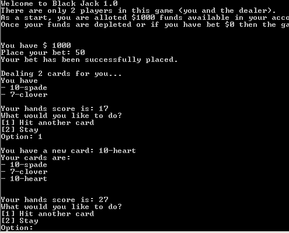

 
 

# JavaScript Game Project

## About

This project is to showcase your knowledge of Javascript that you have learned so far. Using JS, you will build a simple game that will be played in the Console. Happy Coding!

## The Set-Up

- Choose **ONE** game from the options below
- Create a repository with the name of the game you chose.
- Submit an Issue with your GitHub repo URL to this repository.

## The Task

Choose **ONE** of the following games to code:

- Pong

    

 
 
 

- Tic Tac Toe

    

 
 
 

- Connect Four

    

 
 
 

- BlackJack

    

 
 
 

## The Requirements

In your first sprint, you will learn JavaScript basics, including Numbers, Arrays, Functions, and Loops. As you work through the courses and modules, you will apply that knowledge to your game. 

You code must include the following:

- Functions
- Loops  
- Arrays

The game needs to be coded to run in the Console. No HTML or CSS is needed for the project.

As we continue through JavaScript, you will learn how to transform your game with HTML and CSS.

